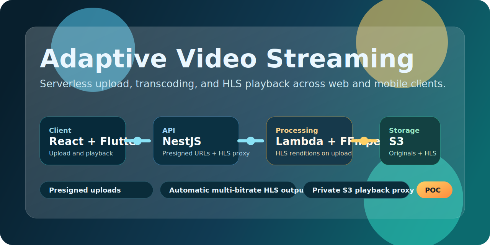
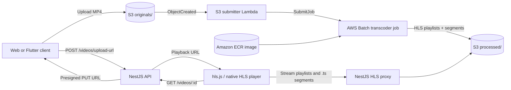
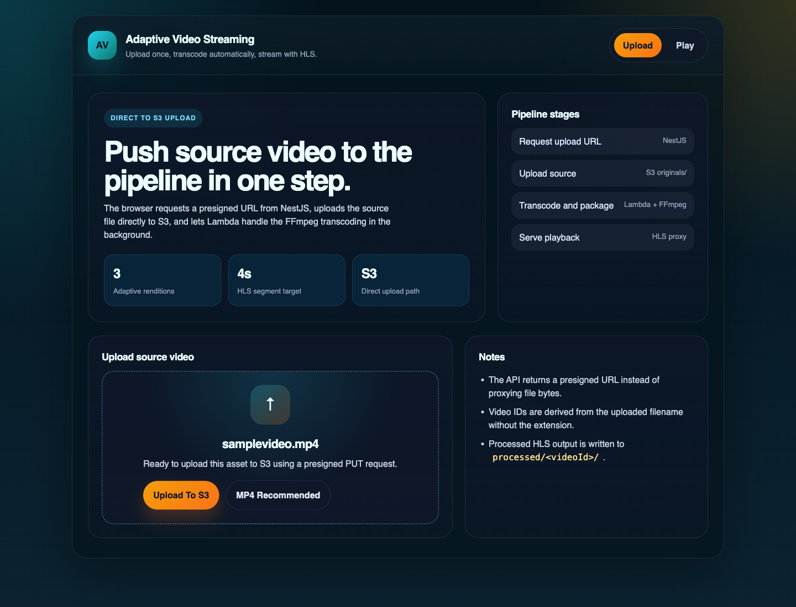
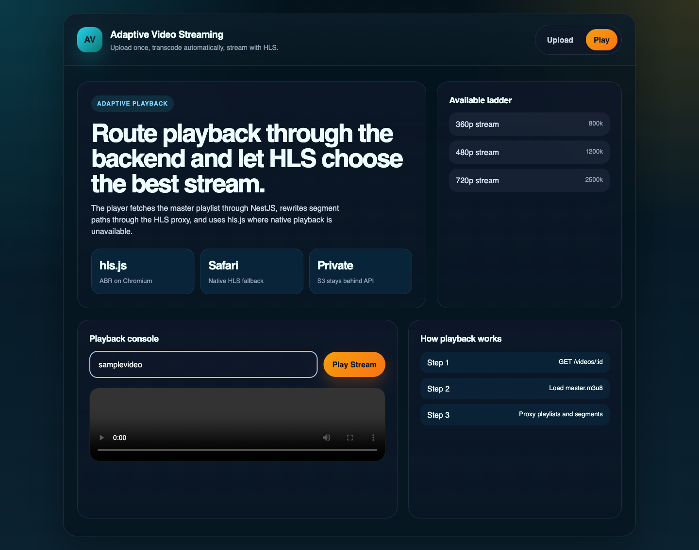

<p align="center">
  
</p>

<h1 align="center">Adaptive Video Streaming</h1>

<p align="center">
  A YouTube-style adaptive streaming proof of concept built with NestJS, React, AWS Batch, ECR, S3, FFmpeg, and HLS.
</p>

<p align="center">
  <a href="https://github.com/Anubhavjain786/Adaptive-Video-Streaming/actions/workflows/ci.yml">
    
  </a>
  
  
  
  
  
  
</p>

## What This Project Does

This repo demonstrates an end-to-end adaptive video pipeline:

- upload a source video directly to S3 with a presigned URL
- trigger an S3 event that submits an AWS Batch transcoding job
- generate multi-bitrate HLS outputs with FFmpeg
- serve playlists and segments through a NestJS proxy
- play the stream in both a React web app and a Flutter client

It is designed as a practical AWS serverless POC, not just a static demo.

## Why It Is Interesting

- Direct-to-S3 uploads keep large file traffic away from the API server.
- AWS Batch removes the 15-minute Lambda ceiling for large videos by running the transcoder as a container job.
- HLS output is generated automatically in 360p, 480p, 720p, 1080p, 2k, and 4k renditions.
- Playback is proxied through the backend, so the browser never talks to a public S3 bucket directly.
- LocalStack support keeps a fast local loop by reusing the local transcoder Lambda path for non-AWS testing.
- The repo contains both web and mobile clients against the same backend contract.

## Architecture At A Glance



More detail is in [ARCHITECTURE.md](./ARCHITECTURE.md).

## Product Screens

The current web client exposes two focused flows: direct upload and adaptive playback.

### Upload flow



### Playback flow



## Repo Assets

- Social preview source: [assets/social-preview.html](./assets/social-preview.html)
- Social preview output: `assets/social-preview.png`

## Stack

| Layer | Tech |
| --- | --- |
| API | NestJS, AWS SDK v3 |
| Web client | React, Vite, hls.js |
| Mobile client | Flutter |
| Video processing | AWS Batch, Amazon ECR, FFmpeg |
| Storage | Amazon S3 |
| Infrastructure | Serverless Framework v3 |
| Local development | LocalStack, Docker Compose |

## Repository Layout

```text
apps/
  backend/        NestJS API for presigned uploads and playback metadata
  frontend/       React + Vite upload UI and HLS player
  flutter_app/    Flutter client for upload and playback
infra/
  lambda/         local transcoder + Batch job submitter Lambdas
  batch/          ECR image source for AWS Batch transcoding
  layers/ffmpeg/  FFmpeg binary reused for local Lambda and Batch image
  serverless.yml  Infrastructure definition
test/
  e2e-test.sh     Local end-to-end validation script
```

## Quick Start

### Prerequisites

- Node.js 18+
- npm
- Docker Desktop
- Serverless Framework
- Docker CLI access for ECR image builds during AWS deploys
- AWS credentials for real AWS deployments
- FFmpeg installed locally if you want the LocalStack flow

### Install

```bash
npm install
cd infra && npm install && cd ..
```

### Run The Web App Locally

```bash
npm run backend
npm run frontend
```

Backend runs on `http://localhost:3000` and the Vite frontend runs on `http://localhost:5173`.

## LocalStack End-To-End Flow

This project supports a realistic local pipeline for upload, processing, and playback.

```bash
brew install ffmpeg
npm install -g serverless

npm run localstack:up
npm run deploy:local
npm run backend:local
npm run frontend
bash test/e2e-test.sh
```

The test script uploads a sample video, invokes the local transcoder path directly, verifies HLS output in LocalStack S3, and prints the playback payload.

## API Surface

| Method | Route | Purpose |
| --- | --- | --- |
| POST | `/videos/upload-url` | Returns `{ uploadUrl, key, videoId }` for direct browser upload |
| GET | `/videos/:id` | Returns the backend playback URL for `master.m3u8` |
| GET | `/videos/hls/*` | Proxies HLS playlists and `.ts` segments from S3 |

## HLS Output

| Rendition | Resolution | Target bitrate | Segment size |
| --- | --- | --- | --- |
| 360p | 640x360 | 800k | 4 seconds |
| 480p | 854x480 | 1200k | 4 seconds |
| 720p | 1280x720 | 2500k | 4 seconds |
| 1080p | 1920x1080 | 5000k | 4 seconds |
| 2k | 2560x1440 | 10000k | 4 seconds |
| 4k | 3840x2160 | 20000k | 4 seconds |

Output is stored under `processed/<videoId>/` and the `videoId` is derived from the uploaded filename without its extension.

## Deployment

### AWS

```bash
npm run deploy
```

`npm run deploy` now builds the transcoder image from `infra/batch/Dockerfile`, pushes it to Amazon ECR, discovers default VPC networking for AWS Batch Fargate, and deploys the stack.

### Local

```bash
npm run deploy:local
```

## Clients

- Web app: upload a video, track upload progress, then play via `hls.js` or native Safari HLS.
- Flutter app: mirrors the same upload/playback flow for mobile testing.

Flutter setup notes are available in [apps/flutter_app/README.md](./apps/flutter_app/README.md).

## Current Constraints

- `videoId` comes from the filename, so duplicate filenames overwrite the same logical stream.
- IAM permissions are intentionally broad for POC simplicity.
- The backend still has no job-status API, so uploads remain asynchronous without progress polling from Batch.
- AWS deployments assume a default VPC unless you explicitly export `BATCH_SUBNET_IDS` and `BATCH_SECURITY_GROUP_IDS` before deploy.

## Roadmap Ideas

- Add thumbnail extraction and preview images
- Introduce async job status tracking in the API
- Support more renditions and codec ladders
- Add authentication and per-user media isolation
- Publish deployment outputs automatically from CI
